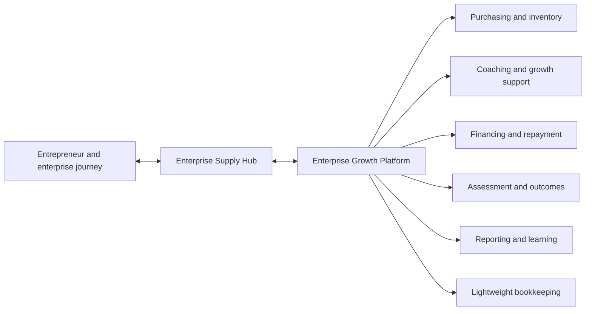

# Invest in Growth Technology Planning

This repository is the central planning, architecture, and cross-repository specification workspace for a technology project supporting **Invest in Growth**, a nonprofit program built around Home Roots Foundation's Reinvest-to-Grow methodology.

The program is intended to help women entrepreneurs in Haiti and other resource-constrained settings retain more business income, reinvest it productively, strengthen their enterprises, and improve economic resilience. Technology is not the intervention. Its role is to help the nonprofit deliver the methodology consistently, measure it responsibly, learn from evidence, and scale what works.

> **Current status:** Planning and feasibility research. No production application, cloud environment, or participant-data system has been implemented from this repository.

## Why This Project Exists

The project began with one conversation about a speech-first mobile bookkeeping application for entrepreneurs living with limited resources, inconsistent connectivity, and barriers to traditional accounting tools.

That conversation led to an initial feasibility architecture and a set of assumed requirements: simple mobile bookkeeping, offline operation, speech and multilingual input, receipt capture, loan administration, and defensible nonprofit reporting.

The nonprofit's vision has since expanded. Mobile bookkeeping remains potentially useful, but it is one capability within a broader **Enterprise Growth Platform** that may eventually coordinate:

- entrepreneur enrollment and enterprise profiles;
- collective purchasing and Supply Hub operations;
- suppliers, inventory, and demand aggregation;
- coaching, training, and action plans;
- appropriate growth financing and repayment;
- productive reinvestment and enterprise assessments;
- longitudinal outcomes, reporting, and organizational learning.

The architecture work in this repository evaluates how the original technical direction can support that broader vision and where the product model and MVP sequence need to change.

## Program Model

Reinvest-to-Grow is based on a proposed enterprise-development pathway:

```text
Retain more income
  -> Reinvest productively
  -> Build productive capital and enterprise capability
  -> Strengthen enterprise performance
  -> Improve economic resilience
```

Its initial operating and validation environment is the **Enterprise Supply Hub**, where collective purchasing may lower inventory costs and improve business margins. Financing, coaching, measurement, and bookkeeping support that journey; none should be treated as the entire methodology.

The methodology is explicitly evidence-seeking. Its causal model, Enterprise Growth Score, and projected outcomes are working propositions to test, not established impact claims. The technology must preserve that distinction by keeping measurements traceable to dated source observations and by supporting continued learning.

## Product Direction

The long-term direction is an offline-capable enterprise growth operating system organized around the entrepreneur and enterprise journey, rather than around loans or accounting transactions alone.



The current directional technology stack is:

| Area | Direction |
| --- | --- |
| Mobile | React Native, Expo, and TypeScript |
| Offline data | SQLite local projection with a durable synchronization queue |
| Staff web | React, Vite, TypeScript, and Material UI |
| Backend | Java and Spring Boot modular monolith |
| Data | PostgreSQL, with S3 for documents |
| Cloud | AWS, provisioned with CDK in TypeScript |
| Integration | Versioned APIs, idempotent writes, and replaceable provider boundaries |
| AI and document processing | Constrained workers for speech, OCR, translation, and structured proposals |
| Delivery | GitHub Actions and specification-driven, cross-repository changes |

These are directional decisions for prototyping, not irreversible platform commitments. The modular monolith is intentional: the operating model is still evolving, so one deployable backend with explicit internal boundaries offers simpler testing, transactions, deployment, and change management than an early microservice architecture.

## Engineering Principles

- **Methodology before software.** Product behavior should follow validated operating workflows, not force the program into a tool's assumptions.
- **Offline first.** Core field workflows must remain usable under unreliable connectivity.
- **Human-centered interaction.** Use plain language, touch-first fallbacks, multilingual design, and confirmation flows appropriate to users' context.
- **AI proposes; people decide.** Speech, OCR, translation, and AI may create structured suggestions, but cannot finalize financial records, approve financing, or manufacture impact claims.
- **Traceability by design.** Important financial and outcome records require source data, validation, audit history, and reproducible reporting.
- **Security from the start.** Role-based access, nonprofit-owned accounts, encryption, tenant isolation, privacy controls, and recovery planning are baseline concerns.
- **Build the differentiation.** Prefer established services for commodity or correctness-sensitive capabilities when they fit; focus custom development on the entrepreneur journey, Supply Hub workflows, reinvestment, measurement, and learning loops that make the program distinct.
- **Evidence before scale.** Use small prototypes and field feedback to resolve product risk before committing to a broad platform build.

## Build, Buy, or Integrate

The research found no single mature product that covers the complete combination of accessible mobile bookkeeping, voice and multilingual interaction, offline use, microfinance operations, Supply Hub workflows, coaching, and traceable impact reporting.

It also found that building every capability from scratch would duplicate mature, difficult systems, especially accounting and loan servicing. The working strategy is therefore hybrid:

1. Evaluate existing products and services where they can reduce cost, risk, and time to learning.
2. Keep identity, integration, audit, reporting, and data portability under clear architectural control.
3. Build custom experiences only where field evidence shows that the program's workflows cannot be served well by existing tools.

The existing build-vs-buy analysis predates the broader Enterprise Growth Platform framing and will be revisited before vendor or implementation commitments.

## MVP Approach

The near-term goal is not to design the full platform. It is to select a narrow MVP that can be placed in users' hands quickly and answer important questions about usability, operations, and technical feasibility.

Two related scopes are being kept separate:

- **Program MVP:** the smallest useful workflow that the nonprofit and participating entrepreneurs should test in a real operating context. This still requires stakeholder alignment and may center on enrollment, Supply Hub purchasing, coaching, financing, bookkeeping, or a carefully selected combination.
- **Technical proof of concept:** a deliberately narrow mobile transaction slice used to test Expo, local data, synchronization, Spring Boot, PostgreSQL, AWS, and cross-repository specifications. It is reusable engineering evidence, not a final product-priority decision.

The current proposed technical spike is:

```text
Expo mobile screen
  -> versioned HTTPS request
  -> Spring Boot modular monolith
  -> PostgreSQL transaction-intake record
  -> idempotent response and visible mobile status
```

Offline SQLite, receipt capture, mocked speech/AI proposals, and a thin staff review screen would follow in small slices after the basic path is proven.

## Current State and Next Steps

Completed work includes:

- an initial mobile bookkeeping and microloan architecture summary;
- nonprofit vision, methodology, operating-model, and investor source documents;
- an alignment review showing where the initial architecture does and does not match the expanded vision;
- build-vs-buy and nonprofit technology-cost research;
- focused research across mobile, offline sync, backend, receipt, speech, AI, and staff-web concerns;
- a rough research-to-prototype plan;
- a draft multi-repository OpenSpec proof-of-concept plan and implementation handoff.

The next milestone is to establish the specification workspace. That work will:

1. Reconcile the repository and product names with the broader program scope.
2. Confirm the first program MVP and the purpose of the technical spike.
3. Initialize the central specification store and project guardrails.
4. Define versioned, testable acceptance criteria across future mobile, backend, infrastructure, and staff-web repositories.
5. Build and evaluate the selected prototype in thin vertical slices.

## What This Repository Holds

This repository is intended to remain the durable, central source for:

- program-to-technology alignment artifacts;
- feasibility studies and technical research;
- system architecture and architecture decision records;
- cross-repository product specifications and contracts;
- MVP proposals, implementation plans, and handoffs;
- security, data-governance, cost, and account-ownership guidance;
- decisions, evidence, and lessons that affect more than one implementation repository.

Application code is expected to live in focused repositories for mobile, backend, infrastructure, staff web, and independently deployed workers as those components become necessary. This repository will coordinate their shared behavior without becoming a catch-all source repository.

## Repository Guide

| Location | Contents |
| --- | --- |
| [`ai-planning/PROJECT_SUMMARY.md`](ai-planning/PROJECT_SUMMARY.md) | Original bookkeeping-centered product and architecture summary |
| [`ai-planning/ALIGNMENT_BRIEF_v0.1.md`](ai-planning/ALIGNMENT_BRIEF_v0.1.md) | Concise comparison of the original architecture with the broader nonprofit vision |
| [`ai-planning/INTERNAL_ARCHITECTURE_ANALYSIS_v0.1.md`](ai-planning/INTERNAL_ARCHITECTURE_ANALYSIS_v0.1.md) | Directional architecture assessment and domain reframing |
| [`ai-planning/BUILD_VS_BUY_ANALYSIS.md`](ai-planning/BUILD_VS_BUY_ANALYSIS.md) | Product landscape and hybrid build/buy/integrate analysis |
| [`ai-planning/jpaul-documents/`](ai-planning/jpaul-documents/) | Source vision, methodology, operating-model, and investor documents |
| [`ai-planning/research/`](ai-planning/research/) | Research agenda and focused technical decision notes |
| [`ai-planning/ai-planning/implementation-plans/`](ai-planning/ai-planning/implementation-plans/) | Research-to-prototype and multi-repository specification plans |
| [`ai-planning/ai-planning/handoff-docs/`](ai-planning/ai-planning/handoff-docs/) | Current-state and execution handoffs |

## Document Status

The materials in this repository capture the evolution of the project. They do not all have equal authority or currency.

- The nonprofit's current approved business and methodology direction takes precedence over earlier technical assumptions.
- Alignment and architecture documents are working artifacts until reviewed with program stakeholders.
- Research notes support decisions but do not constitute product requirements.
- Implementation plans remain drafts until explicitly reviewed and approved.
- Vendor capabilities, prices, nonprofit programs, cloud services, and framework versions are time-sensitive and must be revalidated before execution.
- No document in this repository should be read as evidence that proposed social outcomes or causal relationships have already been proven.

## Intended Audience

This repository is public to make the project's reasoning inspectable.

For potential grant funders and partners, it demonstrates that the program is developing a pragmatic technical path grounded in mission, operational reality, data stewardship, cost awareness, and measurable learning.

For engineers and organizations evaluating the technical work, it demonstrates the architecture process behind an evolving real-world system: discovering the actual domain, correcting early assumptions, separating product and technical risk, evaluating build versus buy, establishing safety boundaries for AI and financial data, and turning research into reviewable specifications and vertical slices.

## Responsible Development

Prototype work must use synthetic data only. Credentials, payment details, recovery codes, participant records, and other sensitive information do not belong in Git. Nonprofit accounts and production data must remain under nonprofit ownership with role-based delegated access and explicit approval for paid services or external deployment.

