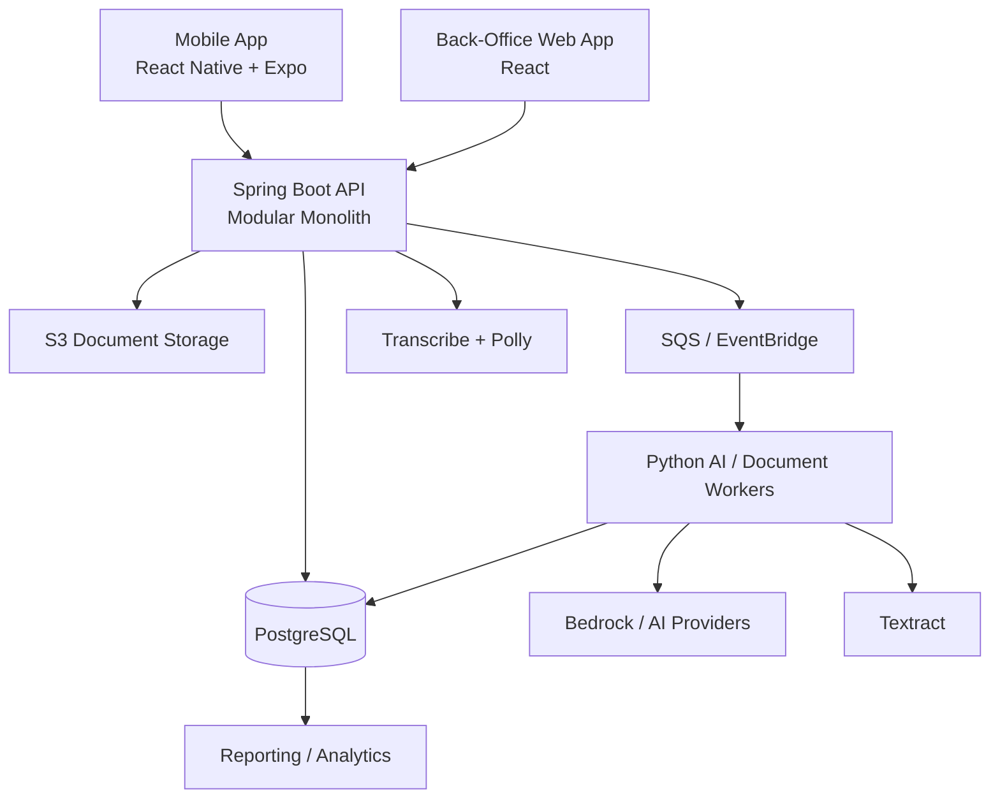

# Chat Transcript: Mobile Bookkeeping Architecture

## User

~~~~text
<environment_context>
  <cwd>/Users/joerice/Library/CloudStorage/GoogleDrive-jizzoerice@gmail.com/My Drive/2026/housing-violations</cwd>
  <shell>zsh</shell>
  <current_date>2026-06-06</current_date>
  <timezone>America/New_York</timezone>
</environment_context>
~~~~

## User

~~~~text
i am a software developer and i am helping A FRIEND write an app.  i will tell you the requirements and you suggest some architecture options.

my friend runs a non-profit helping diaadvantaged small businesses and people in underdeveloped countries.  one of the services he is offering is microloans to small businesses that would repay him.  he is in the process of getting grants from different organizations. one of the feedback he got is they want to see metrics in both positive outcomes for the recipients and profitability / sustainability in his organization.

his idea is a speech-operated app for managing book keeping for the small businesses his organization gives money to.  the idea is to have a simple way for owners to manage their books without specialized bookkeeping or finance skills.  the idea is they can scan receipts and documents and enter data via text.  and one feature would be reporta that track profitability and other metrics needed by the business.

I am intentionally keeping the exact requirements broad.  but some capabilities and requirements:
* offers both a traditional UI and speech-operated
* understand and speak multiole languages
* scans documents of different types
* maintains a financial tracking features but the ux is simple and intuitive and requires no specialized finance and bookeeping skills beyond what is needed to operate a business
* AI to assist in organizing inputs and automating tasks
* reports
* mobile app + back-office apps

I am a softwafre engineer with deep experience in aws, microservicesd, java spring boot, python, relational; dbs, etc.  I havde moderate ui / react / javascript skills.  And i have no mobile app experience (ios or android) and beginning ai development skils.  i will heavilly leverage ai coding assitants and spec driven development.

suggest an architecture, including tech stack, infrastructure, hosting, mobile app publishing, security, and other architectural aspects.  For now, just tryin to bet a directional bal park
~~~~

## Assistant

~~~~markdown
## Directional Recommendation

Build a **multi-tenant, offline-capable SaaS application** with:

- **React Native + Expo** for the business-owner mobile app
- **React** for the nonprofit’s back-office application
- **Spring Boot modular monolith** for the primary backend
- **PostgreSQL** as the financial system of record
- **AWS managed services** for hosting, documents, speech, and AI
- A carefully controlled AI layer that **suggests transactions but never silently changes financial records**

Start as a modular monolith, not microservices. The product and workflows will change substantially during early pilots. Microservices would add deployment, observability, transaction, and testing complexity before providing meaningful value.

---

## High-Level Architecture



## Recommended Stack

| Area | Recommendation |
|---|---|
| Mobile app | React Native, Expo, TypeScript |
| Mobile local storage | SQLite with an offline synchronization layer |
| Back-office UI | React, TypeScript, Vite, Material UI |
| Core backend | Java 21+, Spring Boot |
| AI/document workers | Python, FastAPI or Lambda handlers |
| Database | Amazon Aurora PostgreSQL or RDS PostgreSQL |
| Document storage | S3 with versioning and lifecycle policies |
| Authentication | Amazon Cognito initially |
| Async processing | SQS, EventBridge, Step Functions where useful |
| Hosting | ECS Fargate for backend; CloudFront/S3 or Amplify for web |
| Infrastructure as code | AWS CDK using TypeScript, or Terraform |
| CI/CD | GitHub Actions |
| Monitoring | CloudWatch plus Sentry for mobile/web |
| AI | Amazon Bedrock initially, behind an internal provider interface |
| OCR | Amazon Textract plus fallback/manual review |
| Speech-to-text | Amazon Transcribe initially |
| Text-to-speech | Amazon Polly initially |

Expo is a particularly good fit given your limited native-mobile experience. EAS Build handles Android and iOS binaries, signing credentials, internal test builds, and CI integration. EAS Submit can send builds to both app stores. ([Expo Build](https://docs.expo.dev/build/introduction/), [Expo Submit](https://docs.expo.dev/submit/introduction/))

---

## Core Domain Design

Keep these as separate modules inside the initial backend:

- **Organizations and users**
- **Businesses and business profiles**
- **Financial ledger**
- **Sales, expenses, inventory, and cash movements**
- **Loans, disbursements, and repayments**
- **Documents and extraction jobs**
- **AI suggestions and approvals**
- **Outcome metrics**
- **Reports**
- **Audit history**

### Use Double-Entry Accounting Internally

The UI should never require users to understand debits, credits, or journals. However, the underlying system should use a proper double-entry ledger.

For example, the user says:

> “I bought ten bags of flour for 50 dollars cash.”

The system proposes:

- Expense or inventory purchase: `$50`
- Cash reduction: `$50`
- Receipt/document association
- Suggested category
- Confirmation in plain language

The user sees: **“Record a $50 flour purchase paid with cash?”**

This architecture preserves reliable books without exposing accounting complexity.

---

## AI Architecture

Treat AI as an **untrusted assistant**, not the financial system of record.

Use AI for:

- Converting speech into proposed actions
- Classifying receipts and transactions
- Extracting information from unusual documents
- Translating user interactions
- Explaining reports in plain language
- Detecting possible duplicates or unusual transactions
- Suggesting follow-up questions

Do not let AI:

- Directly create finalized ledger entries
- Change loan balances
- Approve payments
- Produce grant metrics without traceable source data
- Execute arbitrary database or backend operations

Use a constrained workflow:

```text
User input
  → speech/OCR extraction
  → structured AI proposal
  → deterministic validation
  → user confirmation
  → ledger transaction
  → immutable audit record
```

Require AI outputs to match versioned JSON schemas. Store the original input, extracted data, model/version, confidence, corrections, and final approved result.

Amazon Textract’s expense APIs already extract common receipt and invoice fields, line items, totals, vendors, and confidence scores. Human review remains important, especially for handwritten, damaged, or locally formatted documents. ([Textract](https://docs.aws.amazon.com/textract/latest/dg/analyzing-document-expense.html))

---

## Mobile and Speech Considerations

Design the mobile app **offline-first**. Many target users may have expensive, unreliable, or intermittent connectivity.

The app should allow users to:

- Record sales and expenses offline
- Photograph receipts offline
- Review recent transactions
- Queue uploads and synchronization
- Resolve synchronization conflicts
- See clearly whether information is saved locally or synchronized

Speech recognition should be treated as an input method layered over ordinary workflows, not as a separate chatbot. Use guided commands such as:

- “Record a sale”
- “I spent 20 dollars on transportation”
- “How much profit did I make this week?”

Language support must be validated with actual users and accents before committing to markets. Amazon Transcribe and Polly support many languages, but availability and feature depth vary by language. ([Transcribe languages](https://docs.aws.amazon.com/transcribe/latest/dg/supported-languages.html), [Polly languages](https://docs.aws.amazon.com/en_en/polly/latest/dg/supported-languages.html))

---

## Reporting and Grant Metrics

Separate two categories of reporting:

### Business Reports

- Revenue, expenses, and profit
- Cash on hand
- Outstanding customer payments
- Inventory movement
- Loan balance and upcoming payment
- Simple trends and plain-language explanations

### Program Outcome Reports

- Businesses funded and survival rate
- Revenue/profit changes after funding
- Jobs created or retained
- Owner income changes
- Loan repayment and delinquency rates
- Capital deployed and recycled
- Cost to administer each loan
- Portfolio-at-risk metrics
- Demographic and regional outcomes

Record outcome metrics as dated observations with their source and collection method. This makes grant reports defensible instead of merely impressive-looking.

---

## Security

Financial data, identity information, and scanned documents require serious controls even if the nonprofit is small.

Minimum baseline:

- Separate AWS accounts for development, staging, and production
- Encryption through KMS for databases, documents, queues, and backups
- TLS everywhere
- MFA required for staff and administrators
- Role-based access control
- Strict tenant isolation on every query and document path
- Immutable audit events for financial changes
- Malware scanning of uploaded files
- Presigned S3 upload/download URLs
- Automated backups and tested recovery procedures
- Secrets Manager for credentials
- CloudTrail, GuardDuty, and security alerts
- Data retention and deletion policies
- No sensitive data in logs or AI prompts unless necessary

Tenant isolation is especially important because a single nonprofit employee may manage many businesses while each owner must only access their own records. AWS identifies tenant isolation as foundational for multi-tenant SaaS systems. ([AWS tenant isolation](https://docs.aws.amazon.com/whitepapers/latest/saas-tenant-isolation-strategies/saas-tenant-isolation-strategies.html))

---

## Deployment Shape

For an initial pilot:

```text
AWS Organizations
├── Development account
├── Staging account
└── Production account
    ├── ECS Fargate: Spring Boot API
    ├── Lambda/Fargate: Python workers
    ├── RDS PostgreSQL
    ├── S3
    ├── SQS + EventBridge
    ├── Cognito
    ├── CloudFront
    ├── Textract / Transcribe / Polly / Bedrock
    └── CloudWatch
```

Avoid Kubernetes initially. ECS Fargate is much easier to operate and sufficient for a sizable deployment.

Use SQS-driven workers for OCR and AI tasks because they may be slow, expensive, or occasionally fail. The user should be able to continue working while processing happens.

---

## Key Architecture Options

### Option A: AWS-Native Modular Monolith — Recommended

- Spring Boot on ECS Fargate
- RDS/Aurora PostgreSQL
- Cognito
- AWS AI and document services
- React Native with Expo

**Best for:** Your existing skills, controlled operational complexity, and gradual scaling.

### Option B: Serverless-First

- API Gateway, Lambda, Step Functions, DynamoDB/PostgreSQL
- Heavy use of managed AWS services

**Best for:** Very low initial traffic and event-driven workflows.

**Concern:** Financial workflows and reporting often fit relational databases and conventional services better. Java Lambda cold starts and distributed workflow complexity may become annoying.

### Option C: Faster Product Prototype

- Expo/React
- Supabase for PostgreSQL, authentication, storage, and APIs
- External AI/document providers

**Best for:** Rapidly validating UX with a small pilot.

**Concern:** It moves away from your AWS strengths and may require migration or additional controls later.

---

## Suggested Delivery Sequence

1. Build a narrow pilot around sales, expenses, receipt capture, and simple profit reporting.
2. Add offline mobile synchronization.
3. Add speech-based transaction entry for one or two target languages.
4. Add loan tracking and nonprofit back-office views.
5. Add defensible outcome metrics.
6. Add broader document types, languages, and AI automation only after observing real usage.

The largest product risk is probably not the backend architecture. It is whether speech, terminology, reports, and confirmation flows make sense to users across different languages, literacy levels, currencies, and business practices. A field-tested prototype should come before a broad accounting feature set.
~~~~

## User

~~~~text
i like this appeoach option A.  document it AS A markdown file and put it the dirextory shown in the screenshot:  
<image>
~~~~

## Assistant

~~~~markdown
Created [ARCHITECTURE.md](/Users/joerice/Library/CloudStorage/GoogleDrive-jizzoerice@gmail.com/My%20Drive/2026/housing-violations/ARCHITECTURE.md).

It documents Option A across system design, technology stack, financial ledger, AI safeguards, offline mobile behavior, AWS infrastructure, security, reporting, testing, risks, and phased delivery. The directory is not currently a Git repository.
~~~~

## User

~~~~text
assuming we go with aws service recommendation, put together a ballpark estimate of what it would cost to build and maintain, assuming i donated my time for free for initial buildout and my friend found volunteers to maintain it
~~~~

## Assistant

~~~~markdown
Created [COST_ESTIMATE.md](/Users/joerice/Library/CloudStorage/GoogleDrive-jizzoerice@gmail.com/My%20Drive/2026/housing-violations/COST_ESTIMATE.md).

Key estimates:

- **Prototype:** `$500–$3,000` build; `$50–$200/month`
- **100-business pilot:** `$25,000–$40,000` recommended first-year funding; `$250–$750/month`
- **1,000 businesses:** `$800–$2,500/month`
- **10,000 businesses:** `$4,000–$15,000/month`

The document breaks down AWS services, non-cloud expenses, usage assumptions, cost controls, and volunteer-maintenance risks. It also notes eligible nonprofits can apply for up to [$5,000 in annual AWS promotional credits](https://aws.amazon.com/government-education/nonprofits/nonprofit-credit-program/).
~~~~

## User

~~~~text
ok.  now perform a build-vs-buy analysis.  research products that might meet his requirements/. especially saas
~~~~

## Assistant

~~~~markdown
Created [BUILD_VS_BUY_ANALYSIS.md](/Users/joerice/Library/CloudStorage/GoogleDrive-jizzoerice@gmail.com/My%20Drive/2026/housing-violations/BUILD_VS_BUY_ANALYSIS.md).

Main finding: no single SaaS product meets the complete requirement. The recommended approach is hybrid:

- **Loandisk** for the initial loan-management system
- **ActivityInfo** for offline outcome collection and reporting
- Pilot **Talkbooks**, **SparkReceipt/Finovo**, and **Zoho Books** with recipients
- Build a custom recipient app only if field testing proves existing products fail critical workflows
- Consider **Mifos X/Apache Fineract** instead of Loandisk when long-term ownership and extensibility justify additional operational complexity

The document includes product research, capability matrix, costs, architecture options, vendor due-diligence questions, and a staged evaluation plan.
~~~~

## User

~~~~text
<environment_context>
  <current_date>2026-08-05</current_date>
  <timezone>America/New_York</timezone>
  <filesystem><workspace_roots><root>/Users/joerice/Library/CloudStorage/GoogleDrive-jizzoerice@gmail.com/My Drive/2026/housing-violations</root></workspace_roots><permission_profile type="managed"><file_system type="restricted"><entry access="read"><special>:root</special></entry><entry access="write"><path>/Users/joerice/Library/CloudStorage/GoogleDrive-jizzoerice@gmail.com/My Drive/2026/housing-violations</path></entry><entry access="write"><special>:slash_tmp</special></entry><entry access="write"><special>:tmpdir</special></entry><entry access="read"><path>/Users/joerice/Library/CloudStorage/GoogleDrive-jizzoerice@gmail.com/My Drive/2026/housing-violations/.git</path></entry><entry access="read"><path>/Users/joerice/Library/CloudStorage/GoogleDrive-jizzoerice@gmail.com/My Drive/2026/housing-violations/.agents</path></entry><entry access="read"><path>/Users/joerice/Library/CloudStorage/GoogleDrive-jizzoerice@gmail.com/My Drive/2026/housing-violations/.codex</path></entry></file_system></permission_profile></filesystem>
</environment_context>
~~~~

## User

~~~~text
write this whole chat to a markdown doc and put it in /Users/joerice/Library/CloudStorage/GoogleDrive-jizzoerice@gmail.com/My Drive/2026/projects/home-roots/mobie-bookkeeping.  Include all of tne prompts and your ansers.  the prompts capture the requirements.  write-everything as-is
~~~~
