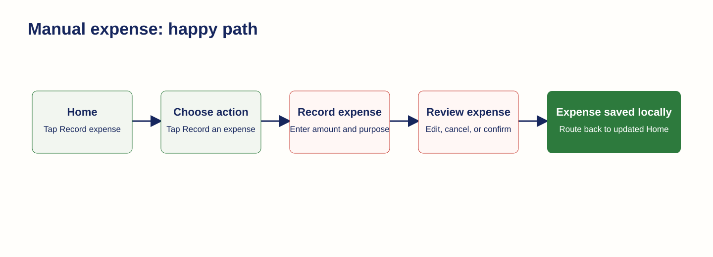
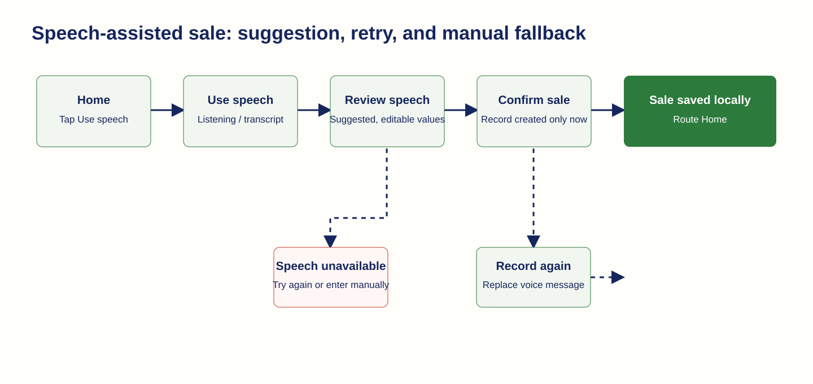

# Mobile Prototype Workflows

These flows use the review PNGs in this directory as the visual source of truth. A record does not exist until the participant selects the applicable confirmation action. All example data is synthetic.

## 1. Record a sale manually

- **Happy path**
  - Start: [Home](home-roots-mobile-home-screen-concept-v1.png).
  - Trigger: tap `Record sale` on Home, or tap `Record a sale` after [Choose what to record](home-roots-mobile-choose-business-moment-concept-v1.png).
  - Enter: [Record a sale](home-roots-mobile-record-sale-concept-v1.png). Enter an amount, item, date, and optional note. The focused numeric-entry state is [keyboard visible](home-roots-mobile-record-sale-keyboard-concept-v1.png).
  - Trigger: tap `Review sale`.
  - Review: [Review sale](home-roots-mobile-review-sale-concept-v1.png). Status label: `Entered by you`. Edit, cancel, or confirm before a record is made.
  - Trigger: tap `Confirm sale`.
  - End: [Sale saved locally](home-roots-mobile-sale-saved-locally-concept-v1.png), status `Saved on this phone`, then route to [updated Home](home-roots-mobile-home-screen-concept-v1.png).
- **Validation alternate**
  - Trigger: tap `Review sale` with no amount.
  - State: [Missing amount](home-roots-mobile-record-sale-validation-error-concept-v1.png). Status message: `Enter the amount you earned.` The participant remains on entry; Review sale is unavailable until corrected.
- **Abandon-entry alternate**
  - Trigger: tap Back before confirmation.
  - State: [Leave unsaved sale](home-roots-mobile-leave-unsaved-sale-concept-v1.png). Status message: `Your details are not saved yet.`
  - End: `Keep recording` returns to manual entry; `Discard sale` returns to [Home](home-roots-mobile-home-screen-concept-v1.png) without changing saved activity.
- **Accessibility check**
  - Use [large-text sale review](home-roots-mobile-review-sale-large-text-concept-v1.png) to verify that text wraps and the fixed Confirm sale action remains reachable.

## 2. Record an expense manually

- **Happy path**
  - Start: [Home](home-roots-mobile-home-screen-concept-v1.png).
  - Trigger: tap `Record expense` on Home, or `Record an expense` after [Choose what to record](home-roots-mobile-choose-business-moment-concept-v1.png).
  - Enter: [Record an expense](home-roots-mobile-record-expense-concept-v1.png). Enter money spent, purpose, date, and optional note.
  - Trigger: tap `Review expense`.
  - Review: [Review expense](home-roots-mobile-review-expense-concept-v1.png). The participant can edit, cancel, or confirm.
  - Trigger: tap `Confirm expense`.
  - End: [Expense saved locally](home-roots-mobile-expense-saved-locally-concept-v1.png), status `Saved on this phone`, then route to [updated Home](home-roots-mobile-home-screen-concept-v1.png).
- **Review guardrail**
  - The app treats this as a local save, not a network success. The confirmation copy says it will send the record when a connection is available.

## 3. Record a sale with speech

- **Happy path**
  - Start: [Home](home-roots-mobile-home-screen-concept-v1.png) or [Choose what to record](home-roots-mobile-choose-business-moment-concept-v1.png).
  - Trigger: tap `Use speech`.
  - Capture: [Use speech](home-roots-mobile-use-speech-concept-v1.png). Status: `Listening`; visible copy says the app will suggest details for review.
  - Trigger: stop listening and tap `Review suggestion`.
  - Review: [Review speech](home-roots-mobile-review-speech-concept-v1.png). The source label and raw message establish that values are suggested, not saved.
  - Trigger: tap `Confirm sale`.
  - End: [Sale saved locally](home-roots-mobile-sale-saved-locally-concept-v1.png), then [Home](home-roots-mobile-home-screen-concept-v1.png).
- **Re-record alternate**
  - Trigger: tap `Record again` during speech review.
  - State: [Selected green re-record design](home-roots-mobile-review-speech-rerecord-concept-v5.png). The action means `Replace this voice message` and returns to [Use speech](home-roots-mobile-use-speech-concept-v1.png). The old message is not confirmed while a replacement is being captured.
- **Speech failure / manual fallback**
  - State: [We could not hear that](home-roots-mobile-speech-unavailable-concept-v1.png). Status message: `Try speaking again, or enter the details yourself.`
  - End: `Try again` returns to [Use speech](home-roots-mobile-use-speech-concept-v1.png); `Enter sale yourself` routes to [Record a sale](home-roots-mobile-record-sale-concept-v1.png).

## 4. Record an expense with a receipt

- **Happy path**
  - Start: [Home](home-roots-mobile-home-screen-concept-v1.png) or [Choose what to record](home-roots-mobile-choose-business-moment-concept-v1.png).
  - Trigger: tap `Scan receipt`.
  - Permission preparation: [Allow camera access](home-roots-mobile-receipt-camera-access-concept-v1.png). Trigger `Allow camera` opens the device-level prompt; this image intentionally depicts only the app preparation state.
  - Capture: [Scan a receipt](home-roots-mobile-scan-receipt-concept-v1.png). Trigger `Take photo` or `Choose from phone` attaches an image.
  - Processing: [Reading your receipt](home-roots-mobile-receipt-processing-concept-v1.png). Status: `Your receipt photo is attached.` No expense has been created yet.
  - Review: [Review receipt](home-roots-mobile-review-receipt-concept-v1.png). The thumbnail, source label, and editable fields distinguish the proposal from a saved expense.
  - Trigger: tap the confirmation action.
  - End: [Expense saved locally](home-roots-mobile-expense-saved-locally-concept-v1.png), then [Home](home-roots-mobile-home-screen-concept-v1.png).
- **Permission alternate**
  - Trigger: participant does not allow camera access.
  - End: `Choose from phone` continues with a stored image; `Enter expense yourself` routes to [Record an expense](home-roots-mobile-record-expense-concept-v1.png).
- **Extraction failure alternate**
  - State: [We could not read this receipt](home-roots-mobile-receipt-extraction-failure-concept-v1.png). Status message: `Your photo is saved. You can enter the expense yourself.`
  - End: `Try another photo` returns to [Scan a receipt](home-roots-mobile-scan-receipt-concept-v1.png); `Enter expense` routes to [Record an expense](home-roots-mobile-record-expense-concept-v1.png), retaining the image when implementation permits.

## 5. Attend to delayed sync

- **Status route**
  - Start: a record has already reached [Sale saved locally](home-roots-mobile-sale-saved-locally-concept-v1.png) or [Expense saved locally](home-roots-mobile-expense-saved-locally-concept-v1.png).
  - Trigger: a later send attempt cannot complete and a retry would be meaningful.
  - State: [Needs attention](home-roots-mobile-sync-needs-attention-concept-v1.png). The key status must say that the record is saved locally and could not be sent yet; it must never claim the record is lost.
  - Trigger: tap `Retry` when connection is available. The app attempts to send and then returns to [Home](home-roots-mobile-home-screen-concept-v1.png) with its current truthful status.
  - Alternate: leave the screen without retrying. The record remains saved on the phone and normal manual entry remains available.

## Screen-Flow Scope

The activity-detail screen is available for usability review at [Sale details](home-roots-mobile-sale-detail-concept-v1.png), reached by tapping an item in [Recent activity](home-roots-mobile-recent-activity-concept-v1.png). It is a later-V1 support state and is deliberately not part of M1’s primary create-record workflows. The first-use path starts on [empty Home](home-roots-mobile-home-empty-concept-v1.png) and joins any workflow through the same quick actions.
