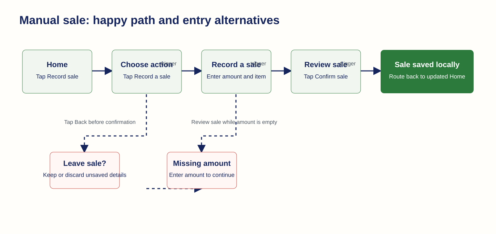
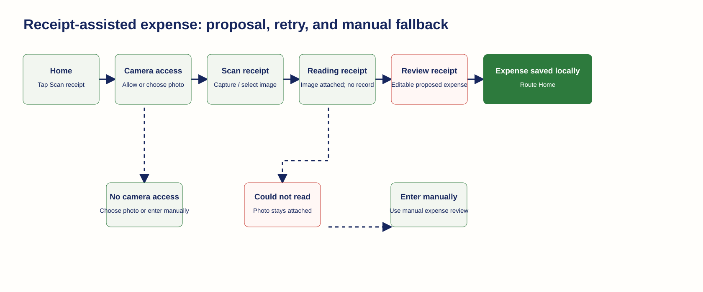
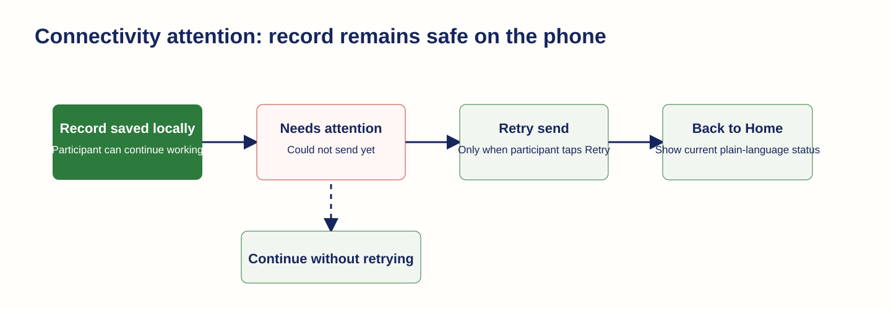

# Mobile Prototype Workflows

Status: Propose-ready M1 scope control

Companion: [M1 Rapid Thin-Slice Prototype Brief](m1-rapid-thin-slice-prototype.md) and [M1 Mobile UI Design Brief and Screen Inventory](m1-mobile-ui-design-brief-and-screen-inventory.md)

These flows use the [M1 asset package](../design-assets/M1/) as the visual source of truth. A record does not exist until the participant selects the applicable confirmation action. All example data is synthetic, uses `HTG`, and is rendered from English/French UI resources. The shared Expo app supports Android and iOS; Android is the required offline physical-device acceptance target and iOS uses TestFlight once Apple resources are approved.

M1 uses SQLite and a local/stubbed sync client only. Screens may demonstrate queued, needs-attention, and retry states, but no M1 action issues a live HTTP request.

## 1. Record a sale manually

**M1 screens used**

- `M01` Home / daily check-in, including its compact recent activity (`M06`).
- `M02` Choose business moment.
- `M03` Manual entry: default, keyboard-visible, validation-error, and leave-unsaved states.
- `M04` Review and confirm: default and text-scaled states.
- `M05` Saved confirmation.

- **Happy path**
  - Start: [Home](../design-assets/M1/home-roots-mobile-home-screen-concept-v1.png).
  - Trigger: tap `Record sale` on Home, or tap `Record a sale` after [Choose what to record](../design-assets/M1/home-roots-mobile-choose-business-moment-concept-v1.png).
  - Enter: [Record a sale](../design-assets/M1/home-roots-mobile-record-sale-concept-v1.png). Enter an amount, item, date, and optional note. The focused numeric-entry state is [keyboard visible](../design-assets/M1/home-roots-mobile-record-sale-keyboard-concept-v1.png).
  - Trigger: tap `Review sale`.
  - Review: [Review sale](../design-assets/M1/home-roots-mobile-review-sale-concept-v1.png). Status label: `Entered by you`. Edit, cancel, or confirm before a record is made.
  - Trigger: tap `Confirm sale`.
  - End: [Sale saved locally](../design-assets/M1/home-roots-mobile-sale-saved-locally-concept-v1.png), status `Saved on this phone`, then route to [updated Home](../design-assets/M1/home-roots-mobile-home-screen-concept-v1.png).
- **Validation alternate**
  - Trigger: tap `Review sale` with no amount.
  - State: [Missing amount](../design-assets/M1/home-roots-mobile-record-sale-validation-error-concept-v1.png). Status message: `Enter the amount you earned.` The participant remains on entry; Review sale is unavailable until corrected.
- **Abandon-entry alternate**
  - Trigger: tap Back before confirmation.
  - State: [Leave unsaved sale](../design-assets/M1/home-roots-mobile-leave-unsaved-sale-concept-v1.png). Status message: `Your details are not saved yet.`
  - End: `Keep recording` returns to manual entry; `Discard sale` returns to [Home](../design-assets/M1/home-roots-mobile-home-screen-concept-v1.png) without changing saved activity.
- **Accessibility check**
  - Use [large-text sale review](../design-assets/M1/home-roots-mobile-review-sale-large-text-concept-v1.png) to verify that text wraps and the fixed Confirm sale action remains reachable.

## 2. Record an expense manually

**M1 screens used**

- `M01` Home / daily check-in, including its compact recent activity (`M06`).
- `M02` Choose business moment.
- `M03` Manual expense entry and manual-entry fallback.
- `M04` Review and confirm.
- `M05` Saved confirmation.

- **Happy path**
  - Start: [Home](../design-assets/M1/home-roots-mobile-home-screen-concept-v1.png).
  - Trigger: tap `Record expense` on Home, or `Record an expense` after [Choose what to record](../design-assets/M1/home-roots-mobile-choose-business-moment-concept-v1.png).
  - Enter: [Record an expense](../design-assets/M1/home-roots-mobile-record-expense-concept-v1.png). Enter money spent, purpose, date, and optional note.
  - Trigger: tap `Review expense`.
  - Review: [Review expense](../design-assets/M1/home-roots-mobile-review-expense-concept-v1.png). The participant can edit, cancel, or confirm.
  - Trigger: tap `Confirm expense`.
  - End: [Expense saved locally](../design-assets/M1/home-roots-mobile-expense-saved-locally-concept-v1.png), status `Saved on this phone`, then route to [updated Home](../design-assets/M1/home-roots-mobile-home-screen-concept-v1.png).
- **Review guardrail**
  - The app treats this as a local save, not a network success. The confirmation copy says it will send the record when a connection is available.

## 3. Record a sale with speech

**M1 screens used**

- `M01` Home / daily check-in, including its compact recent activity (`M06`).
- `M02` Choose business moment.
- `M07` Speech proposal: listening, review, selected re-record, and unavailable states; it is the speech variant of `M04`.
- `M03` Manual sale entry as the fallback.
- `M05` Saved confirmation.

- **Happy path**
  - Start: [Home](../design-assets/M1/home-roots-mobile-home-screen-concept-v1.png) or [Choose what to record](../design-assets/M1/home-roots-mobile-choose-business-moment-concept-v1.png).
  - Trigger: tap `Use speech`.
  - Capture: [Use speech](../design-assets/M1/home-roots-mobile-use-speech-concept-v1.png). Status: `Listening`; visible copy says the app will suggest details for review.
  - Trigger: stop listening and tap `Review suggestion`.
  - Review: [Review speech](../design-assets/M1/home-roots-mobile-review-speech-concept-v1.png). The source label and raw message establish that values are suggested, not saved.
  - Trigger: tap `Confirm sale`.
  - End: [Sale saved locally](../design-assets/M1/home-roots-mobile-sale-saved-locally-concept-v1.png), then [Home](../design-assets/M1/home-roots-mobile-home-screen-concept-v1.png).
- **Re-record alternate**
  - Trigger: tap `Record again` during speech review.
  - State: [Selected green re-record design](../design-assets/M1/home-roots-mobile-review-speech-rerecord-concept-v5.png). The action means `Replace this voice message` and returns to [Use speech](../design-assets/M1/home-roots-mobile-use-speech-concept-v1.png). The old message is not confirmed while a replacement is being captured.
- **Speech failure / manual fallback**
  - State: [We could not hear that](../design-assets/M1/home-roots-mobile-speech-unavailable-concept-v1.png). Status message: `Try speaking again, or enter the details yourself.`
  - End: `Try again` returns to [Use speech](../design-assets/M1/home-roots-mobile-use-speech-concept-v1.png); `Enter sale yourself` routes to [Record a sale](../design-assets/M1/home-roots-mobile-record-sale-concept-v1.png).

## 4. Record an expense with a receipt

**M1 screens used**

- `M01` Home / daily check-in, including its compact recent activity (`M06`).
- `M02` Choose business moment.
- `M08` Receipt capture and proposal: permission preparation, capture, processing, review, and extraction-failure states; its review is the receipt variant of `M04`.
- `M03` Manual expense entry as the fallback.
- `M05` Saved confirmation.

- **Happy path**
  - Start: [Home](../design-assets/M1/home-roots-mobile-home-screen-concept-v1.png) or [Choose what to record](../design-assets/M1/home-roots-mobile-choose-business-moment-concept-v1.png).
  - Trigger: tap `Scan receipt`.
  - Permission preparation: [Allow camera access](../design-assets/M1/home-roots-mobile-receipt-camera-access-concept-v1.png). Trigger `Allow camera` opens the device-level prompt; this image intentionally depicts only the app preparation state.
  - Capture: [Scan a receipt](../design-assets/M1/home-roots-mobile-scan-receipt-concept-v1.png). Trigger `Take photo` or `Choose from phone` attaches an image.
  - Processing: [Reading your receipt](../design-assets/M1/home-roots-mobile-receipt-processing-concept-v1.png). Status: `Your receipt photo is attached.` No expense has been created yet.
  - Review: [Review receipt](../design-assets/M1/home-roots-mobile-review-receipt-concept-v1.png). The thumbnail, source label, and editable fields distinguish the proposal from a saved expense.
  - Trigger: tap the confirmation action.
  - End: [Expense saved locally](../design-assets/M1/home-roots-mobile-expense-saved-locally-concept-v1.png), then [Home](../design-assets/M1/home-roots-mobile-home-screen-concept-v1.png).
- **Permission alternate**
  - Trigger: participant does not allow camera access.
  - End: `Choose from phone` continues with a stored image; `Enter expense yourself` routes to [Record an expense](../design-assets/M1/home-roots-mobile-record-expense-concept-v1.png).
- **Extraction failure alternate**
  - State: [We could not read this receipt](../design-assets/M1/home-roots-mobile-receipt-extraction-failure-concept-v1.png). Status message: `Your photo is saved. You can enter the expense yourself.`
  - End: `Try another photo` returns to [Scan a receipt](../design-assets/M1/home-roots-mobile-scan-receipt-concept-v1.png); `Enter expense` routes to [Record an expense](../design-assets/M1/home-roots-mobile-record-expense-concept-v1.png), retaining the image when implementation permits.

## 5. Attend to delayed sync

**M1 screens used**

- `M05` Saved confirmation as the originating local-record state.
- `M09` Needs-attention sync state and local retry action.
- `M01` Home / daily check-in, including its compact recent activity (`M06`), after retry or dismissal.

- **Status route**
  - Start: a record has already reached [Sale saved locally](../design-assets/M1/home-roots-mobile-sale-saved-locally-concept-v1.png) or [Expense saved locally](../design-assets/M1/home-roots-mobile-expense-saved-locally-concept-v1.png).
  - Trigger: a later send attempt cannot complete and a retry would be meaningful.
  - State: [Needs attention](../design-assets/M1/home-roots-mobile-sync-needs-attention-concept-v1.png). The key status must say that the record is saved locally and could not be sent yet; it must never claim the record is lost.
  - Trigger: tap `Retry` when a local stubbed retry is meaningful. The app records the local retry attempt, returns the item to `Waiting to sync`, and returns to [Home](../design-assets/M1/home-roots-mobile-home-screen-concept-v1.png); it does not claim a remote send succeeded.
  - Alternate: leave the screen without retrying. The record remains saved on the phone and normal manual entry remains available.

## First-Use Path

The first-use path starts on [empty Home](../design-assets/M1/home-roots-mobile-home-empty-concept-v1.png) and joins any workflow through the same quick actions. Transaction detail and correction are deferred to [M1 Later-Phase Deferred Work](m1-later-phase-deferred-work.md).
