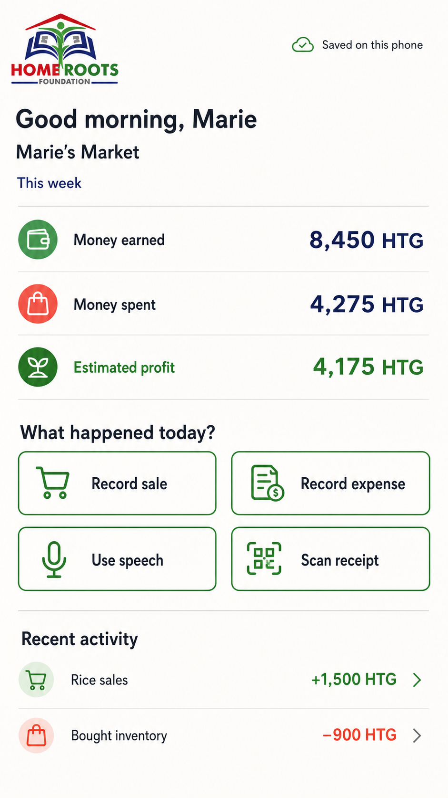

# M1 Mobile UI Design Brief and Screen Inventory

Status: Propose-ready draft; visual control for the M1 implementation proposal
Scope: M1 Rapid Thin-Slice Prototype
Companion: [M1 Rapid Thin-Slice Prototype Brief](m1-rapid-thin-slice-prototype.md), [M1 Mobile Prototype Workflows](m1-mobile-prototype-workflows.md), and [M1 Later-Phase Deferred Work](m1-later-phase-deferred-work.md)

## Purpose

Create a small, coherent set of Android-first mobile screens that make the prototype feel like a trusted Business Journal, not accounting software. The shared Expo implementation supports Android and iOS; Android remains the primary constrained-device design target. This is the visual control for the first prototype; it does not authorize implementation, cloud services, account configuration, or participant-data use.

## User and Job

The primary user is a Home Roots Foundation entrepreneur who runs a small, often cash-based business and may have limited bookkeeping experience, intermittent connectivity, and an older Android phone.

The daily job is simple: understand how the business is doing, then quickly record a sale or expense without fear of losing it or making an irreversible mistake.

## Experience Principles

- Use plain business language: `Money earned`, `Money spent`, and `Estimated profit`; never expose ledger or accounting terms.
- Make sale and expense entry visible and reachable in one tap from Home.
- Manual, button-led entry is always complete. Speech and receipt extraction may assist but only create editable proposals.
- Treat confirmation as the moment a record is created. Clearly label what was entered, what was suggested, and what is saved.
- Make offline normal. Quietly say `Saved on this phone`, `Waiting to sync`, or `Needs attention` only when it helps the user act. M1 never claims that a remote system received the record.
- Design for dignity: large labels and touch targets, short sentences, readable contrast, and icons paired with text for financial actions.
- Use synthetic business data only in all mockups and prototype screens.

## Visual Direction

**Character:** calm, capable, warm, and practical. The product should feel like a reliable assistant at the end of a business day, not a bank portal or a generic Material dashboard.

**Layout:** a single-column mobile flow with a calm header, prominent numerical information, clear section dividers, and spacious action areas. Use cards only for repeated activity items and framed confirmation content; do not turn every page section into a floating card.

**Color roles:** choose accessible, non-brand-specific tokens for a light surface, dark readable text, one primary action color, a distinct success color, a caution color, and an error color. Never use color alone to communicate a financial or sync state. Final values and all interactive-state contrast must be checked against WCAG AA.

**Typography:** use a mobile-friendly sans serif with 16 px minimum body text, strong readable numerical amounts, short labels, and no compressed/negative letter spacing. Keep monetary figures prominent but not hero-sized.

**Controls:** minimum 48 x 48 dp touch targets; full-width primary action buttons where the choice is consequential; labeled icon-and-text quick actions; native numeric keypad for amount entry; familiar date picker; fixed bottom action bar on the review screen.

## Selected Visual Template

The following Home-screen concept is the selected visual pattern for the M1 prototype. It is a design reference, not a pixel-for-pixel implementation specification; recreate it in Figma with the original Home Roots Foundation logo asset rather than extracting the generated logo treatment from this PNG.

### Review Package

The complete, copy-safe M1 visual package is in [design-assets/M1](../design-assets/M1/). Use these companion artifacts when reviewing or recreating the screens in Figma:

- [Screen and state map](../design-assets/M1/screen-state-map.md) - every M1 PNG, grouped by screen with its state and decision status.
- [Mobile prototype workflows](m1-mobile-prototype-workflows.md) - happy, alternate, and error paths with action triggers, status messages, end states, and five embedded workflow diagrams.
- [Selected speech re-record state](../design-assets/M1/home-roots-mobile-review-speech-rerecord-concept-v5.png) - the accepted green concentric-microphone `Record again` visual. Earlier red variants are exploration only.

All generated mockups use an approximate logo treatment. Replace it with the original Home Roots Foundation logo in Figma and implementation work. The `review` folder contains a later-V1 transaction-detail exploration; it is excluded from M1 and is cataloged in [M1 Later-Phase Deferred Work](m1-later-phase-deferred-work.md).

### Template Rules

- Place the actual Home Roots Foundation logo in a compact top-left brand position. Pair it with a quiet, text-and-icon sync status at the top right.
- Use a warm near-white page surface with a deep navy for headings and main amounts. Use a calm green for primary actions and positive values; reserve a darkened coral red for expense/error emphasis. Do not use color as the only distinction between state or meaning.
- Start with a direct greeting, business name, and period. Place the business snapshot before input actions and recent activity.
- Present the three core metrics as aligned rows with an icon, plain-language label, and right-aligned amount. Use simple dividers rather than a grid of dashboard cards.
- Use a two-column grid of large outlined quick-action buttons. Each action has a familiar line icon and a short visible label; screen readers receive an equivalent accessible label.
- Use low-emphasis rows for recent activity: icon, purpose, signed amount, and an optional chevron. An empty state should use the same restrained treatment, not a promotional illustration.
- Keep this composition single-column, spacious, and static. Do not add a persistent bottom navigation bar, decorative imagery, gradients, charts, health scores, or a dense accounting table to M1.

### Provisional Design Tokens

These values capture the selected concept's color stream and should be checked in the implemented components for WCAG AA contrast before becoming production tokens.

| Role | Provisional value | Use |
| --- | --- | --- |
| Page surface | `#FFFEFB` | Primary screen background |
| Primary green | `#2D7A3D` | Primary actions, positive values, saved-local icon |
| Deep navy | `#16265D` | Headings, default amounts, key information |
| Coral red | `#C83E35` | Expense icon/value and error emphasis; pair with text/status |
| Main text | `#1B2430` | Body, labels, and secondary values |
| Divider | `#D9DDD8` | Metric and activity separation |
| Quiet surface | `#F2F6F0` | Subtle icon/container background only |

Typography uses a high-legibility Android sans serif with 16 px minimum body copy; screen headings use a strong but compact weight, labels remain regular, and numerical amounts are bold/right-aligned for scanning. Use a 4 dp spacing scale with 16-24 dp screen gutters, 16-20 dp vertical section gaps, and 8 dp or smaller corner radii for genuinely framed controls. Avoid elevated card stacks.

### Current Drawing Set

The selected Home template is now applied across the M1 asset package. Reuse its header, type, colors, action styling, dividers, and status pattern; do not redesign the visual language per screen.

| Area | Visual states now represented | Review entry point |
| --- | --- | --- |
| Core manual flow | Home populated and empty, action choice, sale and expense entry, review, local-save confirmation, recent activity | [Manual screen map](../design-assets/M1/screen-state-map.md#home-and-activity) |
| Entry resilience | Numeric-keyboard-visible sale entry, missing-amount validation, leave-unsaved-entry confirmation, large-text review | [Manual sale states](../design-assets/M1/screen-state-map.md#manual-sale-entry) |
| Speech assist | Listening/transcript, editable suggested review, selected re-record action, unavailable-speech fallback | [Speech states](../design-assets/M1/screen-state-map.md#speech-assisted-recording) |
| Receipt assist | Camera-access preparation, capture/photo choice, reading/progress, editable proposal, extraction failure | [Receipt states](../design-assets/M1/screen-state-map.md#receipt-assisted-expense-recording) |
| Connectivity attention | Non-blocking needs-attention and retry state | [Connectivity state](../design-assets/M1/screen-state-map.md#connectivity-attention) |

## Information Architecture

For M1, use a single Home screen with task flows opened as full screens or sheets. Do not add persistent bottom navigation yet. The primary route is:

`Home -> Choose action -> Capture details -> Review and confirm -> Saved locally -> Home`

Speech and receipt capture use the same downstream review-and-confirm surface as manual entry.

## Core Content and Copy

| Use | Preferred copy | Avoid |
| --- | --- | --- |
| Sales total | `Money earned` | Revenue, income, credit |
| Expense total | `Money spent` | Debit, operating expense |
| Profit total | `Estimated profit` | Net income |
| Start action | `Record sale` / `Record expense` | Create transaction |
| Confirmation | `Record this sale?` | Submit journal entry |
| Offline success | `Saved on this phone` | Local persistence complete |
| Delayed sync | `Waiting to sync` | Queued / synchronization pending |
| AI/OCR/speech result | `Suggested from ...` | Auto-filled / AI result |

Use the Haitian gourde (`HTG`) consistently for synthetic prototype amounts. M1 ships English and French keyed UI resources, uses the device/app locale as the initial setting, and falls back to English. Format amounts and dates for the active locale while storing `HTG` and minor units independently of display text. A profile/settings language picker and Haitian Creole are deferred; see [M1 Later-Phase Deferred Work](m1-later-phase-deferred-work.md).

## Reusable Components

Define these components before drawing screen variants:

| Component | Required states |
| --- | --- |
| `BusinessMetric` | earned, spent, estimated profit; period and currency shown |
| `BusinessMomentAction` | sale, expense, speech, receipt; icon plus label |
| `TransactionTypePicker` | sale selected, expense selected |
| `MoneyInput` | empty, focused, valid, validation error |
| `CategoryPicker` | common choices, other, selected value |
| `SourceLabel` | entered by you, suggested from speech, suggested from receipt |
| `SyncStatus` | saved on this phone, waiting to sync, simulated needs attention; no live network send in M1 |
| `TransactionListItem` | sale, expense, pending sync, receipt attached |
| `ConfirmationSheet` | manual, speech proposal, receipt proposal; edit, confirm, cancel |
| `PlainLanguageMessage` | no activity, validation error, capture/OCR failure, saved confirmation |

## Primary Flow

### Record a Manual Sale or Expense

1. On Home, the user selects `Record sale` or `Record expense`.
2. The entry screen asks for the amount first, then a plain-language category/purpose. Date defaults to today; note and receipt attachment are optional.
3. The user selects `Review`.
4. The review screen presents a plain-language summary, for example: `Record a 500 HTG sale for rice today?` The user can edit, cancel, or confirm.
5. On confirmation, the app saves the record locally, shows `Saved on this phone`, and returns to an updated Home screen.

### Review a Suggested Record

1. Speech or receipt capture produces a proposal and shows its source label and raw transcript, OCR text, or receipt thumbnail where available.
2. The proposal remains editable and is never treated as a record before confirmation.
3. If capture or extraction fails, show the problem in plain language and offer manual entry without losing the available image or text.

### Workflow Review

Review the major paths with their visual diagrams before implementation work begins:

1. [Manual sale workflow](m1-mobile-prototype-workflows.md#1-record-a-sale-manually) - includes amount validation, the keyboard-visible entry state, and abandoning an unsaved entry.
2. [Manual expense workflow](m1-mobile-prototype-workflows.md#2-record-an-expense-manually) - records money spent with the same review-before-save guardrail.
3. [Speech-assisted sale workflow](m1-mobile-prototype-workflows.md#3-record-a-sale-with-speech) - includes editable suggestions, re-recording, and manual fallback.
4. [Receipt-assisted expense workflow](m1-mobile-prototype-workflows.md#4-record-an-expense-with-a-receipt) - includes permission choice, image processing, proposal review, and extraction failure.
5. [Delayed-sync attention workflow](m1-mobile-prototype-workflows.md#5-attend-to-delayed-sync) - preserves the local record and makes retry optional.

## M1 Screen Inventory

| ID | Screen or state | Priority | Purpose and required content |
| --- | --- | --- | --- |
| M01 | Home / daily check-in | Must | Business name; `This week` period; money earned, money spent, estimated profit; quiet sync state; four quick actions; recent activity. |
| M02 | Choose business moment | Must | Sale, expense, speech, and receipt choices. This can be an action sheet rather than a standalone route. |
| M03 | Manual entry | Must | Type, amount, date, purpose/category, optional note, validation, and `Review` action. Create sale and expense variants from one template; include keyboard-visible and leave-unsaved states. |
| M04 | Review and confirm | Must | Source label; editable values; plain-language summary; raw input/receipt reference when available; `Edit`, `Confirm`, and `Cancel`; include a text-scaled variant with the confirm action reachable. |
| M05 | Saved confirmation | Must | Brief success state: `Saved on this phone`; link or automatic return to updated Home; no technical sync detail. |
| M06 | Recent activity | Must | A compact Home list with date, purpose, signed amount, and status. Design at least five synthetic records plus an empty state. |
| M07 | Speech proposal | Must | Listening/transcript state, editable proposal, selected green re-record action, and fallback to manual entry. This is an M1 phase-2 variant of M04, not a new record model. |
| M08 | Receipt capture and proposal | Must | Camera-permission preparation, camera/image-picker entry, receipt thumbnail, extraction progress/result/failure, editable proposal, and manual fallback. This is an M1 phase-3 variant of M04. |
| M09 | Needs-attention sync state | Must | Non-blocking local/stubbed-sync explanation and retry simulation only when user action is meaningful; never say data is lost without evidence. |

Deferred transaction detail, reports, settings, onboarding, loans, and general AI work are intentionally outside this table and live in [M1 Later-Phase Deferred Work](m1-later-phase-deferred-work.md).

## Figma File Structure

Create one `Enterprise Growth App V1` Figma Design file with these pages:

1. `00 Foundations` - colors, type, spacing, icons, elevation, and accessibility notes.
2. `01 Components` - the reusable components and their required states.
3. `02 M1 Manual Flow` - M01 through M06 with prototype links.
4. `03 Speech and Receipt Variants` - M07 through M09 with prototype links.
5. `04 Review and Feedback` - annotated alternate ideas and stakeholder comments; keep unfinished exploration out of the primary flow.

Use a representative small Android artboard, then check the same layouts on an iPhone artboard for safe-area, wrapping, and touch-target regressions. Design the keyboard-visible amount-entry state and a text-scaled state for M03 and M04 before sign-off. Review English and French copy for overflow; implementation automation must target stable `testID` values rather than translated visible text.

## Completion Criteria for the First Mockup Set

- A reviewer can tap through manual sale and expense entry without interpreting accounting language.
- The review screen visibly distinguishes a suggestion from a confirmed record.
- All primary actions are labeled, reachable, and usable on a small Android screen and a representative iPhone viewport.
- Home, entry, review, saved, and failure/empty states are represented before visual polish expands.
- The review package contains a state map and workflow diagrams that account for every primary action, confirmation, alternate route, and error/fallback condition in the prototype.
- Keyboard-visible and text-scaled states prove the entry and confirmation controls remain usable on a small Android viewport.
- The design uses only synthetic names, business data, receipts, and transaction examples.
- Screens identify the intended source of truth for implementation: project-owned components on top of the selected React Native UI foundation.

## Remaining Decisions

- Confirm the nonprofit-owned Apple Developer/App Store Connect owner and the named iPhone TestFlight testers before iOS distribution work begins.
- Confirm direct Android preview APK installation or Google Play closed testing for Android testers.
- Validate French strings, visual tokens, and meaningful copy with representative entrepreneurs before treating the look and feel as final.
